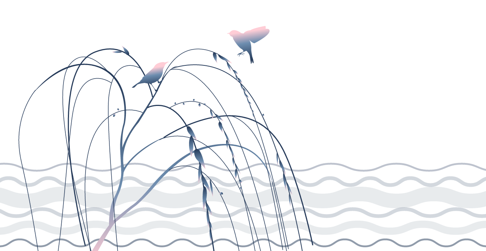
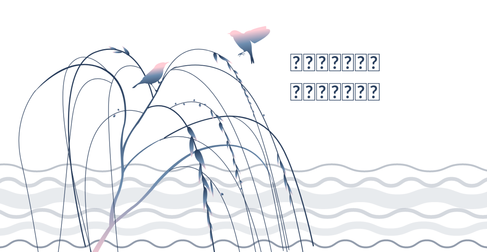
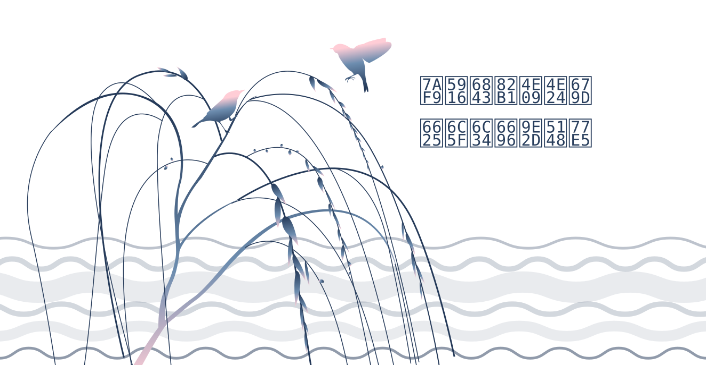
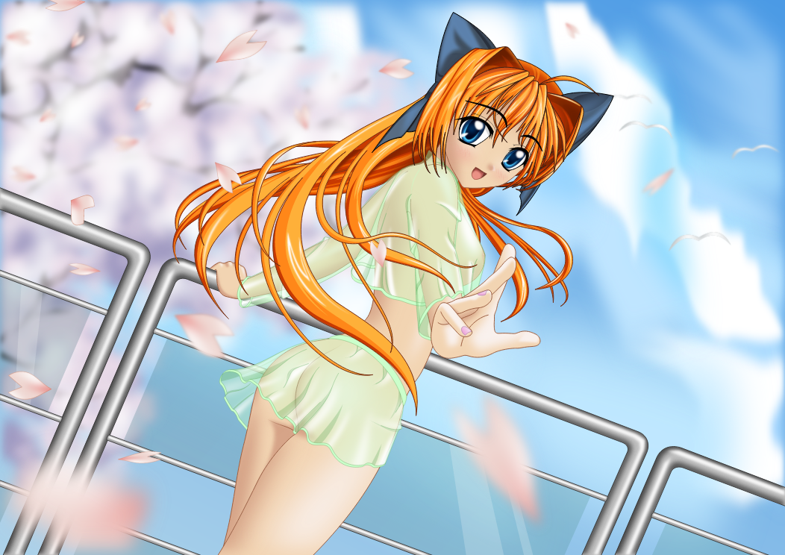
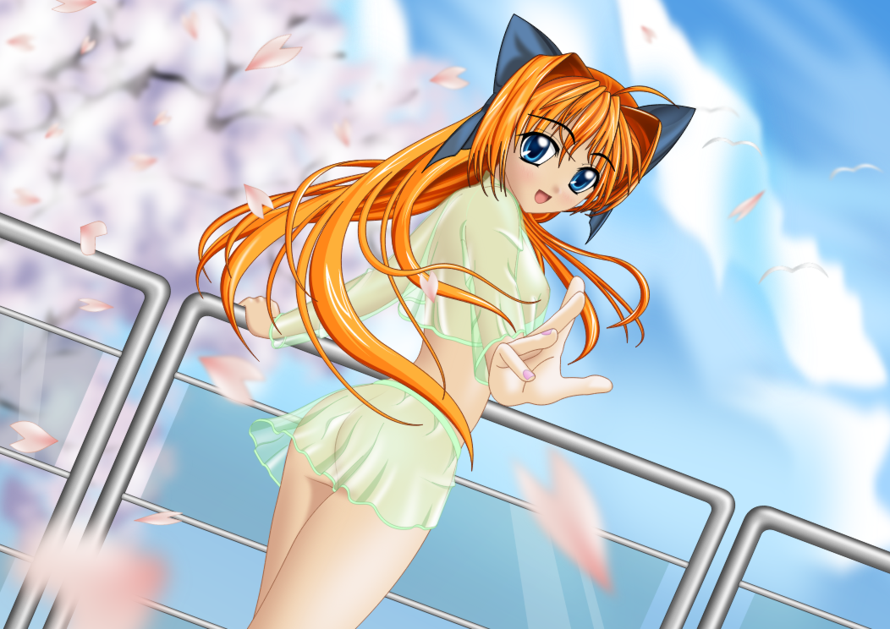
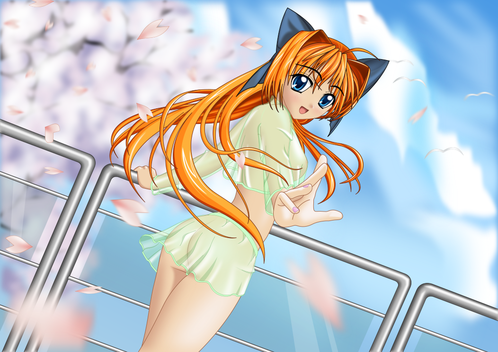

# svg2png-wasm benchmark

```yaml
  System:
    OS: Linux 5.11 Ubuntu 20.04.3 LTS (Focal Fossa)
    CPU: (2) x64 Intel(R) Xeon(R) Platinum 8171M CPU @ 2.60GHz
    Memory: 2.44 GB / 6.79 GB
  Binaries:
    Node: 16.13.1 - /opt/hostedtoolcache/node/16.13.1/x64/bin/node
    npm: 8.1.2 - /opt/hostedtoolcache/node/16.13.1/x64/bin/npm
  npmPackages:
    @napi-rs/canvas: ^0.1.19 => 0.1.19 
    @resvg/resvg-js: ^1.3.0 => 1.3.0 
    sharp: ^0.29.3 => 0.29.3 
    svg2png-wasm: link:.. => 1.3.2 
```


## icon

Source SVG: [icon](../logo.svg)

|Renderer|Speed|Output|
|:-------|----:|:----:|
|svg2png-wasm|1961.27 ops/s, ±0.7%||
|@resvg/resvg-js|**4870.36 ops/s, ±0.33%**||
|resvg|128.94 ops/s, ±1.57%||
|@napi-rs/canvas|2222.71 ops/s, ±2.23%||
|sharp|430.54 ops/s, ±1.21%||

_Wed Jan 05 2022 19:50:47 GMT+0000 (Coordinated Universal Time)_


## tiger

Source SVG: [tiger](./input/tiger.svg)

|Renderer|Speed|Output|
|:-------|----:|:----:|
|svg2png-wasm|15.77 ops/s, ±0.62%||
|@resvg/resvg-js|**37.86 ops/s, ±0.51%**||
|resvg|22.54 ops/s, ±0.64%||
|@napi-rs/canvas|14.21 ops/s, ±0.88%||
|sharp|18.63 ops/s, ±1.05%||

_Wed Jan 05 2022 19:51:16 GMT+0000 (Coordinated Universal Time)_


## text

Source SVG: [text](./input/text.svg)

|Renderer|Speed|Output|
|:-------|----:|:----:|
|svg2png-wasm|2.32 ops/s, ±0.71%||
|@resvg/resvg-js|**12.62 ops/s, ±0.47%**||
|resvg|8.23 ops/s, ±0.87%||
|@napi-rs/canvas|5.76 ops/s, ±2.56%||
|sharp|10.62 ops/s, ±1.12%||

_Wed Jan 05 2022 19:51:49 GMT+0000 (Coordinated Universal Time)_


## animeGirl

Source SVG: [animeGirl](./input/animeGirl.svg)

|Renderer|Speed|Output|
|:-------|----:|:----:|
|svg2png-wasm|0.016 ops/s, ±0.03%||
|@resvg/resvg-js|0.183 ops/s, ±0.5%||
|resvg|0.163 ops/s, ±2.23%||
|@napi-rs/canvas|**1.007 ops/s, ±1.47%**||
|sharp|0.162 ops/s, ±16.69%||

_Wed Jan 05 2022 20:02:35 GMT+0000 (Coordinated Universal Time)_

